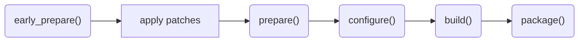

---

Jinx is a "meta-build-system" designed for bootstrapping operating systems. Primarily used by hobby OSDev projects such as [Gloire](https://codeberg.org/Ironclad/Gloire) to aid in the creation of an image distribution. Jinx utilises a lightweight Debian "container" to provide a consistent build environment on every host system.

## Table of Contents

Links to different points in this documentation:
- [Acquisition](<#acquisition>)
- [Basic Project Structure](<#basic-project-structure>)
- [Commands](<#commands>)
	- [`init`](<#init>)
	- [`build`](<#build>)
	- [`update`](<#update>)
	- [`rebuild`](<#rebuild>)
	- [`host-build`](<#host-build>)
	- [`host-rebuild`](<#host-rebuild>)
	- [`regenerate`](<#regenerate>)
	- [`install`](<#install>)
	- [`dry-run`](<#dry-run>)
	- [`download`](<#download>)
	- [`run-in`](<#run-in>)
	- [`rebuild-cache`](<#rebuild-cache>)
- [Rebuild Behavior](<#rebuild-behavior>)
- [Jinxfile](<#jinxfile>)
- [Environment Variables](<#environment-variables>)
- [Recipes](<#recipes>)
	- [Properties](<#properties>)
		- [`name`](<#name>)
		- [`version`](<#version>)
		- [`revision`](<#revision>)
		- [`source_dir`](<#source_dir>)
		- [`from_source`](<#from_source>)
		- [`tarball_url`](<#tarball_url>)
		- [`tarball_blake2b`](<#tarball_blake2b>)
		- [`tarball_sha256`](<#tarball_sha256>)
		- [`tarball_sha512`](<#tarball_sha512>)
		- [`git_url`](<#git_url>)
		- [`commit`](<#commit>)
		- [`shallow`](<#shallow>)
		- [`deps`](<#deps>)
		- [`builddeps`](<#builddeps>)
		- [`hostdeps`](<#hostdeps>)
		- [`hostrundeps`](<#hostrundeps>)
		- [`imagedeps`](<#imagedeps>)
		- [`allow_network`](<#allow_network>)
		- [`cross_compile`](<#cross_compile>)
		- [`bootstrap_pkg`](<#bootstrap_pkg>)
		- [`clean_workdirs`](<#clean_workdirs>)
		- [`source_*`](<#source_>)
	- [Functions](<#functions>)
		- [`early_prepare()`](<#early_prepare>)
		- [`prepare()`](<#prepare>)
		- [`configure()`](<#configure>)
		- [`build()`](<#build-1>)
		- [`package()`](<#package>)
	- [Host Recipes](<#host-recipes>)
	- [Source Recipes](<#source-recipes>)
	- [Patches](<#patches>)

## Acquisition

Ensure the following prerequisites have been acquired:
- `bash` (the `jinx` script itself is written in bash).
- A POSIX-compatible shell located at `/bin/sh` (used by Jinx internally to drive `unshare`/`chroot` and to bootstrap the container environment).
- `awk`.
- LLVM Clang, or the GNU C Compiler.
- `curl`.
- `diff` from a `diffutils` package.
- `find` and `xargs` from a `findutils` package.
- `git`.
- GNU `make`.
- `grep`.
- `gzip`.
- `patch`.
- `pkg-config` (or `pkgconf`).
- `sed`.
- `tar`.
- `wget`.
- `zstd`.
- `free` from a `procps` package.
- `unshare` from a `util-linux` package.
- `libarchive(-dev)`, `libssl(-dev)`/`openssl(-dev)`, and `zlib(-dev)` (needed to build XBPS the first time).

>[!warning]
>It is ***imperative*** that jinx be run under Linux, as the container environment relies on non-POSIX Linux features (user namespaces, mount namespaces, `chroot`). You ***will*** run into issues on other systems.

Download the `jinx` executable script from https://codeberg.org/mintsuki/jinx. Ensure that it is marked as executable with `chmod +x jinx`. Optionally, install it system-wide with `make install` (it accepts the standard `PREFIX` and `DESTDIR` variables). Finally, verify that it is functional with `jinx help` to display the help output.

## Basic Project Structure

Jinx enforces **out-of-tree** builds. There are two distinct directories involved:

1. The **source directory** holds the project's recipes, patches, and the `Jinxfile`.
2. The **build directory** is initialised by `jinx init` and is where build artifacts, packages, and the `.jinx-parameters` file live.

A typical source directory looks as follows:

```
example-source/
|-- Jinxfile
|-- host-recipes/
|-- patches/
|-- recipes/
\-- source-recipes/
```

- `Jinxfile` -> Jinx configuration file. Place required version/snapshot variables, optional global variables and helper functions referenced by recipes here. See [Jinxfile](<#jinxfile>).

- `host-recipes/` -> Recipes that produce results destined for usage on the host system. Typically for cross-compiler toolchain building. See [Host Recipes](<#host-recipes>).

- `patches/` -> Contains patches to be applied to recipe sources. See [Patches](<#patches>).

- `recipes/` -> Generic recipes for most purposes. Will be handled exclusively within the container environment, however, they can act as sources for host recipes if referenced through the `from_source` property. See [Recipes](<#recipes>).

- `source-recipes/` -> Recipes that only act to provide prepared sources for other recipes, to later be built. Referenced by the [`from_source`](<#from_source>) property within a recipe. See [Source Recipes](<#source-recipes>).

After running `jinx init`, the build directory has the following layout (some entries are created lazily as builds happen):

```
example-build/
|-- .jinx-parameters
|-- builds/        # configure/build/package output for normal recipes
|-- host-builds/   # configure/build/package output for host recipes
|-- host-pkgs/     # built host packages, ready to use from the host
\-- pkgs/          # XBPS package files and the XBPS repository index
```

Additionally, the **source directory** will gain a few extra entries during use:

```
example-source/
|-- .jinx-cache/   # XBPS, debootstrap, container image cache
\-- sources/       # downloaded/cloned recipe sources
```

>[!note]
>In-tree builds are explicitly forbidden. Running `jinx init` from a directory that already contains a `Jinxfile` will fail.

>[!tip]
>Multiple build directories may share the same source directory. This is convenient for keeping side-by-side builds for different architectures, configurations, or experiments.

## Commands

A brief summary for each command can be found within the usage output of `jinx help`:

```
usage: jinx <command> <package(s)>

   help|--help        Displays this message
   version|--version  Prints the version
   init               Initialises a build directory
   build              Builds package(s), does incremental builds
   update             Update package(s) and their dependencies if necessary
   rebuild            Rebuilds package(s)
   host-build         Same as build, but for host package(s)
   host-rebuild       Same as rebuild, but for host package(s)
   regenerate|regen   Regenerates patch for package(s) and re-runs prepare step
   install            Installs package(s) (use '-f' to reinstall)
   dry-run            Prints all packages that need to be built in order (space separated)
   download           Downloads pre-built package(s) from remote repo
   run-in             Runs a command in a container prepared with a recipe's hostdeps
   rebuild-cache      Rebuilds Jinx cache

example: jinx update '*'
```

>[!tip]
>For most commands, an argument of `'*'` (or any shell glob) can be used in place of recipe names; Jinx expands it against the relevant recipes directory. This is great for "full" distributions. Exceptions: [`regenerate`](<#regenerate>) and [`run-in`](<#run-in>) take recipe names verbatim and do not perform glob expansion.

#### `init`

Initialises the current directory as a build directory. The first argument is the path to the source directory (which must contain a `Jinxfile`). Any further arguments of the form `KEY=VALUE` are written into `.jinx-parameters` prefixed with `JINX_`.

Usage:

```sh
jinx init <source-dir> [KEY=VALUE]...
```

Example:

```sh
mkdir build && cd build
../source/jinx init ../source ARCH=x86_64
```

This produces a `.jinx-parameters` file containing at minimum `JINX_SOURCE_DIR` and `JINX_ARCH` (which defaults to `$(uname -m)` if not overridden via `ARCH=...`). Any extra arguments become `JINX_<KEY>="<VALUE>"`.

>[!note]
>To "deinitialise" a build directory, simply remove `.jinx-parameters`. There is no separate `deinit` command.

#### `build`

Followed by as many arguments as recipes to build. `build` will *not* attempt to build host recipes unless one is a specified dependency of a to-be-built recipe.

Builds are **incremental**: the recipe's build directory is preserved across invocations whenever a matching XBPS package file already exists, so `make` (or whichever build tool the recipe uses) can do its own incremental work. Unlike [`update`](<#update>), `build` will re-invoke the recipe's `build()` and `package()` functions even when nothing has changed.

#### `update`

Builds the specified package(s) and their transitive host/normal dependencies, but **only** when the corresponding XBPS package file is missing (for normal deps) or when the host package directory is missing (for host deps). Other recipes are skipped. This is the typical command to use during incremental development.

If invoked with no arguments, behaves as `update '*'`.

#### `rebuild`

Forces a rebuild of the specified package(s) by removing the build directory first. This causes the recipe's [`configure()`](<#configure>) function to be re-run on the next build.

#### `host-build`

Same as `build`, but for `host-recipes/`.

#### `host-rebuild`

Same as `rebuild`, but for `host-recipes/`.

#### `regenerate`

- Alias: `regen`

Regenerates `patches/<name>/jinx-working-patch.patch` from any in-place modifications made to `sources/<name>-workdir/`, then re-runs the [`prepare()`](<#prepare>) step. Use this when iterating on patches: edit the working copy, run `regen`, then `rebuild` the recipe.

#### `install`

```sh
jinx install [-f] <sysroot> <package(s)>
```

Installs the specified package(s) into the given system root directory. Each package is built first if it has not been built yet (unless Jinx is invoked as root, in which case it errors out instead of attempting a build).

The `-f` flag **forces** the installation, removing any pre-existing version of the package from the sysroot beforehand. After installation, Jinx checks for file conflicts between the installed packages; if any duplicate paths are detected, it lists them and exits with an error.

>[!note]
>`install` is the only command allowed to run as root, since populating a sysroot may require root privileges depending on file ownership/permissions.

>[!warning]
>The `install` command requires a "sysroot" directory as the first positional argument before the package list. Example: `jinx install sysroot/ base`.

#### `dry-run`

Prints, on a single line space-separated, the topological order of packages that would be built to satisfy the given target(s) (or `'*'` if no target is given). Already-built packages are omitted. Host packages appear with a `host:` prefix immediately before the first regular package that depends on them.

This is useful for scripting (for example, building one package at a time in CI to keep memory low) and for quickly inspecting what an `update` will do without actually building anything.

#### `download`

```sh
jinx download <package(s)>
```

Fetches pre-built XBPS files for the specified package(s) and their transitive dependencies from the URL set in `JINX_REPO_URL` (Jinxfile variable). Each downloaded file's SHA256 is verified against the repository's `index.plist`, and the local repo index is updated.

Errors out if `JINX_REPO_URL` is not set in the `Jinxfile`.

#### `run-in`

```sh
jinx run-in <recipe> <command> [args...]
```

Prepares a container as if it were going to build `<recipe>` (sysroot populated with `deps`, host packages from `hostdeps`/`hostrundeps`, Debian packages from `imagedeps`), then runs the given command inside it from the recipe's build directory. Network access is enabled.

Useful for interactive debugging of build failures, running utilities against a populated sysroot, or one-off tasks inside the same environment a recipe sees.

#### `rebuild-cache`

Purges and re-creates `.jinx-cache/`. This re-downloads XBPS, re-runs `debootstrap`, and rebuilds the base container image. Run this if the cache becomes corrupt; otherwise, Jinx automatically refreshes the cache when its version, the Debian snapshot, or the base packages list change.

## Rebuild Behavior

Jinx identifies built packages purely by their XBPS filename, `<name>-<version>_<revision>.<arch>.xbps`. When this file is present in the build directory's `pkgs/`, the recipe is considered already built; when it is missing (because `version` was bumped, `revision` was bumped, or the file was deleted), Jinx rebuilds the recipe.

### What triggers a rebuild

A recipe is rebuilt under any of these conditions:

1. You explicitly run [`build`](<#build>) or [`rebuild`](<#rebuild>) on it. `build` always re-runs the recipe's `build()` + `package()` stages (skipping `configure()` if the build directory still exists from a previous run); `rebuild` additionally removes the build directory first so `configure()` reruns from scratch.
2. You run [`update`](<#update>) (or `update '*'`) and the recipe's current `name-version_revision.xbps` is missing.
3. The recipe's `version` or `revision` changed since it was last built. The expected XBPS filename no longer matches any existing artifact, so the file appears "missing" - `update` will then rebuild it, and `do_pkg`'s internal `.built` marker mismatch will additionally clean the unpacked source tree, forcing a fresh fetch/patch/prepare for the next build.

### Dependency walking

All build-driving commands walk **downward** through the dependency tree, rebuilding anything whose XBPS file (or, for host deps, `host-pkgs/<pkg>/` directory) is missing along the way:

- [`build <pkg>`](<#build>) / [`rebuild <pkg>`](<#rebuild>) iterate each direct dep and host-dep of `<pkg>`, recursing so that any missing artifact in the closure is rebuilt before `<pkg>` itself.
- [`update <pkg>`](<#update>) performs the same walk, gated on `<pkg>` itself being missing; the walk uses one topological sort over `<pkg>`'s entire transitive closure.
- [`dry-run`](<#dry-run>) performs the same walk in preview mode and prints what *would* be rebuilt, in build order.

Topological sorting is required for correctness: before any recipe builds, every transitive dep of it must already have its XBPS file in `pkgs/`, because `do_pkg` uses `xbps-install` to populate the build sysroot. Sorting deps-first ensures that is always the case.

### Reverse dependencies are *not* automatically rebuilt

If you bump a library's `version` or `revision`, Jinx will rebuild that library, but **not** packages that depend on it. The dependents' XBPS files still exist with their original versions, so all the commands above (including `update '*'`) consider them already built. Jinx does not track which artifacts were built against which others.

When a library's ABI/soname changes and its dependents need recompiling, the conventional workflow (matching xbps-src and PKGBUILD-style systems) is:

1. Bump the affected library's `version` or `revision`.
2. Bump `revision=` on every affected reverse-dependency recipe to mark them as needing a rebuild too.
3. Run `jinx update '*'`. The topological sort will rebuild the library first, then each dependent in the right order.

If you only do step 1, dependents keep their existing XBPS files until you delete them manually, run `jinx rebuild <dep>` for each, or bump their `revision`.

## Jinxfile

When building **any** recipe, Jinx sources the `Jinxfile` from the source directory. Variables and functions defined within this file will be visible to recipes, allowing the definition of default compiler flags, helper functions, and so on. The `Jinxfile` is sourced by bash, so any valid bash syntax is accepted (POSIX shell syntax is a subset, so older POSIX-style Jinxfiles continue to work unchanged).

A *bare minimum* `Jinxfile` is as follows:

```sh
#! /bin/sh

# Minimum Jinxfile for Jinx 0.8.x.

# *Required.* Ensures the project's expected major version matches the running jinx.
JINX_MAJOR_VER=0.8

# *Required.* Pins the Debian snapshot used for the container's base image.
# See https://snapshot.debian.org/ for available snapshot identifiers.
JINX_DEBIAN_SNAPSHOT=20251101T000000Z

# Any further logic, helper functions, or variable definitions will *also* be
# visible to every recipe.
```

The full set of Jinx-recognised variables in a `Jinxfile`:

| Variable                | Required | Purpose                                                                                                       |
| ----------------------- | -------- | ------------------------------------------------------------------------------------------------------------- |
| `JINX_MAJOR_VER`        | yes      | Major version of Jinx the project targets. Must match the running `jinx` binary.                              |
| `JINX_DEBIAN_SNAPSHOT`  | yes      | Debian snapshot timestamp used to bootstrap the container's base image.                                       |
| `JINX_BASE_PACKAGES`    | no       | Extra Debian packages to install into the base container image (added to Jinx's default set).                 |
| `JINX_CMAKE_PLATFORM`   | no       | Path (relative to the source directory) of a CMake platform file to drop into the container's CMake modules.  |
| `JINX_REPO_URL`         | no       | URL for the [`download`](<#download>) command to fetch pre-built packages from.                               |

`JINX_ARCH` is **not** read from the `Jinxfile`; it is set in `.jinx-parameters` (defaulting to `$(uname -m)`, overridable via `jinx init <src> ARCH=...`).

>[!note]
>Helper functions referenced by recipes will be run inside the container, and will *not* run on the host.

## Environment Variables

Several environment variables can be set when invoking `jinx` to alter its behaviour:

- `JINX_PARALLELISM`: Override the `parallelism` value passed to recipes. By default, Jinx auto-tunes this from the number of online CPUs and available RAM (roughly one job per ~2 GiB of RAM, capped by `nproc`).
- `JINX_CACHE_DIR`: Override the cache location. Defaults to `<source-dir>/.jinx-cache`.
- `JINX_CLEAN_WORKDIRS`: When set to `yes`, Jinx removes the recipe's build directory and downloaded sources after a successful package build, on a per-recipe basis (a recipe may opt out via [`clean_workdirs=no`](<#clean_workdirs>)).
- `JINX_NATIVE_MODE`: When set to `yes`, Jinx mounts the in-progress sysroot directly as the container root for non-cross recipes (any recipe without [`cross_compile=yes`](<#cross_compile>)). This is intended for native (host arch == target arch) builds.
- `JINX_NATIVE_LANG`: When `JINX_NATIVE_MODE=yes` and the container is the sysroot, controls the value of `LANG` inside the container. Defaults to `C`.

## Recipes

In the Jinx build system, packages are specified by shell scripts called "recipes". There are several types of recipes, but all follow the same sort of system.

### Properties

Defined within the recipe, there are a number of properties that determine how Jinx will handle building the recipe. The full list is below.

>[!note]
>"Properties", as they are referred to in this documentation, are just shell variables that Jinx makes use of. Recipes are sourced by bash, so any valid bash syntax for defining these variables will be accepted (POSIX shell syntax is a subset and continues to work unchanged).

#### `name`

- **Required**.

Basic property to define the name of the package that the recipe specifies. There is an expectation that the value of this property is equal to the file name of the recipe; the `name` property is used to find associated [Patches](<#patches>) and to identify the build/package directories for the recipe.

Example:

```sh
#! /bin/sh
# recipes/test

name=test
# ...
```

#### `version`

- **Required**, but not for host recipes.

Specifies the version of this recipe. This **should** be set to the version number of the source this package is for (e.g. `version=2.69` for `autoconf-2.69`). Jinx uses the `version` property internally to determine whether to rebuild a package after a version bump (this is why bumping `version` (or `revision`) automatically invalidates a previous build).

Example:

```sh
#! /bin/sh
# recipes/test

# ...
version=2.4.0
# ...
```

#### `revision`

- **Required.**

Used together with `version` to identify the built XBPS package file (`<name>-<version>_<revision>.<arch>.xbps`). Bump `revision` when the recipe's build logic or patches change without a version change, so that the package is rebuilt and reinstalled.

Example:

```sh
#! /bin/sh
# recipes/test

# ...
revision=1
# ...
```

#### `source_dir`

- **Optional.**
- Overrides other source options.

Tells Jinx to use the source directory specified in the recipe (interpreted relative to the source directory containing `Jinxfile`), marking the recipe as a "local package". This is useful for building code that lives in the same project as the recipes.

>[!warning]
>Files *outside* of the source directory will be **inaccessible** within the build container. Place all sources for local packages somewhere inside the source directory.

Example:

```sh
#! /bin/sh
# recipes/test

# ...
source_dir="test/"
# ...
```

>[!tip]
>This works particularly well for building the kernel from a project directory, especially for OSDev projects.
>
>For example:
>
>```sh
>#! /bin/sh
># recipes/kernel
>
>name=kernel
>version=0
>revision=1
>source_dir="kernel" # Our kernel project is within the `kernel/` directory.
># ...
>```

#### `from_source`

- **Optional**.

Specifies another recipe to draw from for build sources. This can be a specialised source recipe in `source-recipes/`, or a normal recipe in `recipes/`.

>[!note]
>Jinx will prioritise a source recipe **over** a normal recipe when searching for a recipe specified by this property. This means a normal recipe of the same name as a source recipe can specify the latter in `from_source` without conflict.

>[!warning]
>Host recipes are **not** valid sources for the `from_source` property.

Example:

```sh
#! /bin/sh
# recipes/test

# ...
from_source="test" # Refers to source-recipes/test (or recipes/test as a fallback).
# ...
```

#### `tarball_url`

- **Optional**.

Specifies a URL to download a tarball from, to use as the source for this recipe. The tarball is verified against a checksum before extraction.

>[!warning]
>A method of checksum validation **must** be specified. This can be done by setting [`tarball_blake2b`](<#tarball_blake2b>), [`tarball_sha256`](<#tarball_sha256>), or [`tarball_sha512`](<#tarball_sha512>). You can set the value of any of these to `"?"` and Jinx will fill the recipe in for you on first download.

>[!tip]
>The [`version`](<#version>) property can be embedded within this property for the sake of convenience.
>
>For example:
>```sh
>#! /bin/sh
># recipes/xtrans
>
>version=1.6.0
>tarball_url="https://www.x.org/archive/individual/lib/xtrans-${version}.tar.gz"
># ...
>```

#### `tarball_blake2b`

- **Required** for [`tarball_url`](<#tarball_url>) checksum (one of `tarball_blake2b`, `tarball_sha256`, `tarball_sha512`).

Specifies a BLAKE2B checksum for verifying the tarball. Setting it to `"?"` makes Jinx auto-fill the value into the recipe on first download.

Example:

```sh
#! /bin/sh
# recipes/xtrans

# ...
tarball_blake2b="446035fb78ec796c1534f36dc687b40fbe6227d47a623039314117a85cc4b3e37971934790932e46a6dc362de70dfb58ccd1fae43518461789ce8854e27adba8"
# ...
```

#### `tarball_sha256`

- **Required** for [`tarball_url`](<#tarball_url>) checksum (one of `tarball_blake2b`, `tarball_sha256`, `tarball_sha512`).

Specifies a SHA256 checksum for verifying the tarball. Setting it to `"?"` makes Jinx auto-fill the value into the recipe on first download.

Example:

```sh
#! /bin/sh
# recipes/test

# ...
tarball_sha256="97efeda496274082e4ed0edf641a7ce5559d4b030fd6b16547e2f13c6d9d00d5"
# ...
```

#### `tarball_sha512`

- **Required** for [`tarball_url`](<#tarball_url>) checksum (one of `tarball_blake2b`, `tarball_sha256`, `tarball_sha512`).

Specifies a SHA512 checksum for verifying the tarball. Setting it to `"?"` makes Jinx auto-fill the value into the recipe on first download.

Example:

```sh
#! /bin/sh
# recipes/test

# ...
tarball_sha512="172acc1bc70350b1f7e46063e98c4a5ce4dd3c245a7e7bd383d8fce4a44ea0d46057b55af0aa279cda1d4b1413e924377ccce9562cef9e83eb6e30fc136a383c"
# ...
```

#### `git_url`

- **Optional**.

URL to a Git repository that will be cloned to be used as the source for this recipe. Requires a [`commit`](<#commit>) property to specify the commit to check out.

Example:

```sh
#! /bin/sh
# source-recipes/libgcc-binaries

# ...
git_url="https://codeberg.org/osdev/libgcc-binaries.git"
# ...
```

#### `commit`

- **Required** for [`git_url`](<#git_url>).
- Must be a 40-character lowercase hex string.

Specifies the commit to check out from a Git repository specified by [`git_url`](<#git_url>). Branch names and tags are not accepted; this must be a full commit hash so that builds remain reproducible.

Example:

```sh
#! /bin/sh
# source-recipes/libgcc-binaries

# ...
commit="28257019ce04f784337cb9c3125abb4d02cef14d"
# ...
```

#### `shallow`

- **Optional**.
- `yes`/`no`. Default: `yes`.

Controls whether [`git_url`](<#git_url>) clones are shallow. By default, Jinx performs a shallow `--revision=<commit> --depth=1` clone of the requested commit. Set `shallow=no` to perform a full clone instead, which is useful when the recipe's `prepare()` or `build()` needs git history (e.g. `git describe` for version stamping).

Example:

```sh
#! /bin/sh
# source-recipes/test

# ...
git_url="https://example.com/test.git"
commit="0123456789abcdef0123456789abcdef01234567"
shallow=no
# ...
```

#### `deps`

- **Optional.**
- Space-separated list of recipes.

Specifies normal-recipe dependencies that must be built before this recipe will work. `deps` are also recorded as **runtime** dependencies in the produced XBPS metadata, so they are pulled in when this package is installed.

Dependencies in `deps` must **only** be normal recipes (i.e. files in `recipes/`).

Example:

```sh
#! /bin/sh
# recipes/test

# ...
deps="thing1 thing2"
# ...
```

#### `builddeps`

- **Optional.**
- Space-separated list of recipes.

Specifies normal-recipe dependencies that must be built before this recipe will work, but that are **not** recorded as runtime dependencies in the resulting XBPS package. Use this for build-only requirements (e.g. compilers, code generators, header-only libraries that don't ship into the final package).

As with `deps`, only normal recipes are valid here.

Example:

```sh
#! /bin/sh
# recipes/test

# ...
builddeps="autoconf gettext-host"
# ...
```

#### `hostdeps`

- **Optional**.
- Space-separated list of recipes.

Specifies host recipes that must be built before this recipe will work, primarily for the **build** stage (cross compilers, code generators, etc.). Dependencies in `hostdeps` must **only** be host recipes (i.e. files in `host-recipes/`).

Example:

```sh
#! /bin/sh
# recipes/test

# ...
hostdeps="gcc binutils"
# ...
```

#### `hostrundeps`

- **Optional**.
- Space-separated list of recipes.

Specifies host recipes that must be available at run time when this recipe is itself used by another recipe (transitive host dependencies). Like `hostdeps`, these must be host recipes only. The split between `hostdeps` and `hostrundeps` lets you express that a host tool needs *another* host tool to run, without requiring every consumer of the first tool to know about the second.

Example:

```sh
#! /bin/sh
# host-recipes/automake

# ...
hostdeps="autoconf"
hostrundeps="autoconf" # automake invokes autoconf at runtime as well as build time
# ...
```

#### `imagedeps`

- **Optional**.
- Space-separated list of Debian packages.

Specifies Debian packages that must be installed into the container environment before this recipe is built. This could be something like `build-essential` for a recipe that needs to compile C code, or `meson` for a recipe that builds with Meson.

Each unique combination of `imagedeps` produces a cached container image under `.jinx-cache/sets/`, so reusing the same set across many recipes is cheap.

Example:

```sh
#! /bin/sh
# recipes/test

# ...
imagedeps="build-essential patchelf"
# ...
```

#### `allow_network`

- **Optional**.
- `yes`/`no`.

If `yes`, the build container is given access to the network. Otherwise, the container is run with `--net` and is fully isolated from the network.

>[!warning]
>This must not be relied on for security when building untrusted recipes. The container is **not** a virtual machine.

Example:

```sh
#! /bin/sh
# recipes/test

# ...
allow_network=yes
# ...
```

#### `cross_compile`

- **Optional**.
- `yes`/`no`.

When [`JINX_NATIVE_MODE=yes`](<#environment-variables>) is set, Jinx normally builds non-host recipes by mounting the sysroot directly as the container root. Setting `cross_compile=yes` on a recipe forces Jinx to use the cross-compile flow (separate sysroot mounted at `/sysroot`) regardless of `JINX_NATIVE_MODE`. This is the right choice for recipes that fundamentally need a cross-toolchain, such as `binutils` or `gcc` targeting a non-host architecture.

Has no effect when `JINX_NATIVE_MODE` is not set.

Example:

```sh
#! /bin/sh
# host-recipes/gcc

# ...
cross_compile=yes
# ...
```

#### `bootstrap_pkg`

- **Optional**.
- `yes`/`no`.

When `yes`, Jinx will not record this recipe as a runtime dependency of any other package, nor install it into a sysroot via `jinx install`. Use this for packages that exist purely to bootstrap the build environment (e.g. minimal early libc/runtime headers used to build the real toolchain) and that should not appear in a finished image.

Example:

```sh
#! /bin/sh
# recipes/mlibc-headers

# ...
bootstrap_pkg=yes
# ...
```

#### `clean_workdirs`

- **Optional**.
- `yes`/`no`.

Per-recipe override for the [`JINX_CLEAN_WORKDIRS`](<#environment-variables>) environment variable. Setting `clean_workdirs=no` keeps this recipe's build directory and downloaded sources around even when `JINX_CLEAN_WORKDIRS=yes` is set globally. Handy for recipes you iterate on frequently.

Example:

```sh
#! /bin/sh
# recipes/kernel

# ...
clean_workdirs=no
# ...
```

#### `source_*`

- **Optional**.

Recipes may also provide `source_deps`, `source_imagedeps`, `source_hostdeps`, and `source_allow_network` properties. These have effect in two situations:

1. **Within the recipe itself**, they apply only to the source-preparation stages ([`early_prepare()`](<#early_prepare>) and [`prepare()`](<#prepare>)).
2. **When this recipe is referenced by another recipe via [`from_source`](<#from_source>)**, they replace the consuming recipe's corresponding properties (`deps`, `imagedeps`, `hostdeps`, `allow_network`) for the duration of the source-preparation stages.

This split is essential when source preparation needs different tools/network access than the actual build (for example, fetching submodules requires network and `git`, but the build itself does not).

### Functions

Within a Jinx recipe, the recipe may specify the logic for different stages of package building as named functions. Functions may reference the recipe's properties or globally defined variables and functions from the [`Jinxfile`](<#jinxfile>), using bash syntax (POSIX shell syntax also works).



> [!note]
>No function is technically ***required*** to exist for a build to succeed; however, without functionality, the recipe does nothing. This is normal for [Source Recipes](<#source-recipes>) that only declare a download URL and rely on the consuming recipe to do the actual work.

> [!warning]
> Aside from [`early_prepare()`](<#early_prepare>) and [`prepare()`](<#prepare>), these functions all run within the **build directory** for the recipe. The build directory does not contain the sources by default, so reference the source directory through the `source_dir` variable that Jinx sets during these stages, e.g. `${source_dir}/configure`. It is recommended that only the `early_prepare()` and `prepare()` steps modify the source directory.

#### `early_prepare()`

The very first bit of recipe logic to run. `early_prepare()` is invoked **after** sources have been fetched (Git clone or tarball extraction) but **before** any patches are applied. It runs from the source directory.

Use it for tasks that must run on a pristine, unpatched source tree. For example, downloading additional vendored sources that the project's own build scripts expect, or removing files that should not be patched.

This function is run with the `source_*` dependencies (see [`source_*`](<#source_>)) when the recipe is referenced as a source.

Example:

```sh
#! /bin/sh
# source-recipes/gcc

# ...
source_allow_network=yes
# ...
early_prepare() {
	./contrib/download_prerequisites
}
# ...
```

#### `prepare()`

Runs after [`early_prepare()`](<#early_prepare>) and after patches have been applied. Like `early_prepare()`, it runs from the source directory.

This is an optimal place to do any further preparation of sources that a [patch](<#patches>) is unable to do, such as running `autoreconf`, regenerating Makefiles, etc.

Example:

```sh
#! /bin/sh
# source-recipes/test

# ...
source_imagedeps="autoconf-archive"
prepare() {
	autoreconf -fvi
}
# ...
```

#### `configure()`

Following the [`prepare()`](<#prepare>) stage, `configure()` is intended for getting the sources ready for building. As the name suggests, the `configure()` stage is most suited to projects that require a `./configure` invocation before builds. This stage runs only when the recipe's build directory does not yet exist: on the first build, after [`rebuild`](<#rebuild>), after a `version` or `revision` bump (which causes the next build command to wipe the build directory before re-running), or after `JINX_CLEAN_WORKDIRS=yes` cleared it at the end of the previous build.

Example:

```sh
#! /bin/sh
# recipes/test

# ...
configure() {
	CFLAGS="$TARGET_CFLAGS" \
	LDFLAGS="$TARGET_LDFLAGS" \
	"${source_dir}"/configure \
		--prefix="${prefix}"
}
# ...
```

>[!tip]
>Reference the internal `prefix` variable during `configure()`. For normal recipes, `prefix` defaults to `/usr`; for host recipes it defaults to `/usr/local`. You can of course pass any other value if your project demands it.

#### `build()`

Run on every build. The `build()` function contains the logic used to compile the recipe.

Example:

```sh
#! /bin/sh
# recipes/test

# ...
build() {
	make -j${parallelism}
}
# ...
```

>[!tip]
>Referencing the internal `parallelism` variable yields the pre-calculated optimal number of parallel jobs. It can be overridden at invocation time with the [`JINX_PARALLELISM`](<#environment-variables>) environment variable.

#### `package()`

Final stage in a recipe. After all other logic has been run, `package()` installs the build results into the recipe's package directory, which Jinx then turns into an XBPS package (for normal recipes) or leaves under `host-pkgs/` (for host recipes). The location to install the build results into is given by the `dest_dir` variable.

Example:

```sh
#! /bin/sh
# recipes/test

# ...
package() {
	DESTDIR="${dest_dir}" make install
}
# ...
```

>[!tip]
>The `package()` function is also a good place for post-install actions like binary stripping or generating wrapper scripts.

>[!note]
>After `package()` returns, Jinx removes any `*.la` libtool files from the package directory, since they generally cause more trouble than they solve.

### Host Recipes

Located in `host-recipes/`, host recipes describe packages that should be built for the host system, as opposed to the target system. The recipes are still built within the container. Host recipes are valuable for building cross-compiler toolchains, code generators, and other tools used during the build of normal recipes.

Host recipes can **not** themselves be used in `from_source`, but they can refer to a normal recipe or source recipe through `from_source`.

>[!warning]
>Linking against dynamic shared libraries *may* have unexpected behaviour when the resulting binary is run from the host: it could try to load a library that is not installed on the host. Static linking, or relying solely on libraries provided by `imagedeps`, is the safer route.

>[!note]
>Outputs from host recipes end up in `host-pkgs/<name>/` (relative to the build directory) and can be run from there. For example: `./host-pkgs/limine/usr/local/bin/limine bios-install testos.iso`.

### Source Recipes

Located in `source-recipes/`, source recipes are not built as recipes themselves. They exist to provide sources (and optionally an [`early_prepare()`](<#early_prepare>)/[`prepare()`](<#prepare>) stage) for other recipes. This type of recipe is prioritised over normal recipes when searching for a matching recipe in a [`from_source`](<#from_source>) property.

Source recipes commonly carry `git_url`/`commit` or `tarball_url`/`tarball_*` properties along with build-environment requirements like `imagedeps` and `hostdeps`.

### Patches

Jinx provides a fairly reasonable way to patch existing software sources for the needs of the target system. For each recipe that wants its sources patched, place patch files under `patches/<name>/`, where `<name>` matches the recipe's [`name`](<#name>) property (or, when a normal recipe consumes a source recipe via [`from_source`](<#from_source>), the source recipe's `name`).

Patches are applied in this order:

1. All files in `patches/<name>/` other than `jinx-working-patch.patch`, in the order returned by shell glob expansion (lexicographic).
2. A snapshot of the source tree is then saved as `sources/<name>-clean/` (the "clean reference" used by [`regenerate`](<#regenerate>) to compute the working patch).
3. `patches/<name>/jinx-working-patch.patch` is applied last, if present.

Steps 1 and 3 happen *before* the [`prepare()`](<#prepare>) stage but *after* [`early_prepare()`](<#early_prepare>).

>[!tip]
>The intended workflow is:
>1. Run `jinx update <recipe>` once to pull and prepare sources.
>2. Edit `sources/<recipe>-workdir/` directly to iterate on changes.
>3. Run `jinx regen <recipe>` to fold those edits into `patches/<recipe>/jinx-working-patch.patch`.
>4. Run `jinx rebuild <recipe>` to verify.
>
>Static patches that you don't want `regen` to fold into can be dropped into `patches/<recipe>/` under any name other than `jinx-working-patch.patch`.

>[!tip]
>If you'd rather author patches outside Jinx's `regen` workflow, the standard `diff` command works:
>
>```sh
>diff -urN --no-dereference binutils/ binutils-modified/ > patches/binutils/0001-my-change.patch
>```
>
>Here, `binutils/` is the original, unmodified version of the source, and `binutils-modified/` contains the changes you want to turn into a patch.
